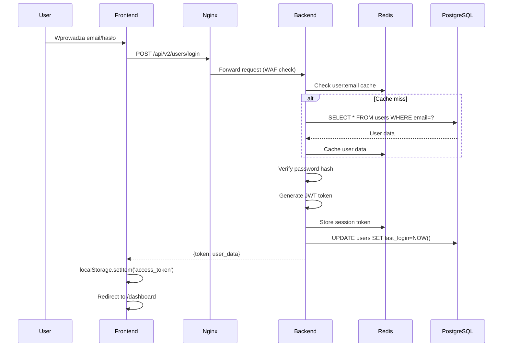

# 🔍 ANALIZA POŁĄCZENIA: PANEL KLIENTA ↔ BACKEND ↔ BAZA DANYCH

## 📊 ARCHITEKTURA SYSTEMU

```
┌─────────────────────────────────────────────────────────────────────────┐
│                           PANEL KLIENTA (Frontend)                      │
│  ┌─────────────┐  ┌─────────────┐  ┌─────────────┐  ┌──────────────┐  │
│  │ Login Form  │  │  Dashboard  │  │  Settings   │  │ Trading View │  │
│  └──────┬──────┘  └──────┬──────┘  └──────┬──────┘  └──────┬───────┘  │
│         │                 │                 │                │          │
│  ┌──────┴─────────────────┴─────────────────┴────────────────┴──────┐  │
│  │                    JavaScript API Client                          │  │
│  │  - localStorage (token)                                          │  │
│  │  - fetch() with Authorization headers                           │  │
│  │  - Real-time updates (30s/10s/5s intervals)                    │  │
│  └────────────────────────────┬─────────────────────────────────────┘  │
└───────────────────────────────┼─────────────────────────────────────────┘
                                │ HTTPS/WSS
                                ↓
┌─────────────────────────────────────────────────────────────────────────┐
│                          NGINX GATEWAY                                  │
│  - SSL Termination                                                      │
│  - Rate Limiting                                                        │
│  - Security Headers (CSP, HSTS, X-Frame-Options)                      │
└────────────────────────────┬────────────────────────────────────────────┘
                             │ HTTP/WS
                             ↓
┌─────────────────────────────────────────────────────────────────────────┐
│                       BACKEND (FastAPI + Uvicorn)                       │
│  ┌──────────────────────────────────────────────────────────────────┐  │
│  │                        MIDDLEWARE STACK                           │  │
│  │  1. WAF (Web Application Firewall)                              │  │
│  │  2. Rate Limiting (100 req/min)                                 │  │
│  │  3. CSP (Content Security Policy)                               │  │
│  │  4. Request Tracking & Telemetry                                │  │
│  └────────────────────────────┬─────────────────────────────────────┘  │
│                               ↓                                         │
│  ┌──────────────────────────────────────────────────────────────────┐  │
│  │                      API ROUTES (v2)                             │  │
│  │  /api/v2/users/*    - Authentication & User Management          │  │
│  │  /api/v2/trading/*  - Trading Operations & Data                 │  │
│  │  /api/v2/debug/*    - System Health & Monitoring               │  │
│  │  /ws                - WebSocket for Real-time Updates          │  │
│  └────────────────────────────┬─────────────────────────────────────┘  │
│                               ↓                                         │
│  ┌──────────────────────────────────────────────────────────────────┐  │
│  │                    SERVICE LAYER                                 │  │
│  │  - UserService      (Business Logic)                            │  │
│  │  - TradingService   (Mock Trading Logic)                        │  │
│  │  - WebSearchService (External API Integration)                  │  │
│  │  - GeminiService    (AI Integration)                            │  │
│  └────────────────────────────┬─────────────────────────────────────┘  │
│                               ↓                                         │
│  ┌──────────────────────────────────────────────────────────────────┐  │
│  │                 INFRASTRUCTURE LAYER                             │  │
│  │  - Circuit Breakers (Resilience)                                │  │
│  │  - Cache Layer (Redis)                                          │  │
│  │  - Audit Logging                                                │  │
│  │  - Monitoring (SLO)                                             │  │
│  └────────────────────────────┬─────────────────────────────────────┘  │
└───────────────────────────────┼─────────────────────────────────────────┘
                                │
                ┌───────────────┴──────────────┐
                ↓                              ↓
┌─────────────────────────────┐  ┌─────────────────────────────┐
│      REDIS CACHE            │  │    POSTGRESQL DATABASE      │
│  - Session Storage          │  │  - Users Table              │
│  - User Data Cache          │  │  - Sessions Table           │
│  - API Response Cache       │  │  - Trading_Positions Table  │
│  - Rate Limit Counters      │  │  - Audit_Log Table         │
│  - Temporary Data           │  │  - Settings Table          │
└─────────────────────────────┘  └─────────────────────────────┘
```

## 🔄 PRZEPŁYW DANYCH

### 1. **AUTENTYKACJA (Login Flow)**



### 2. **POBIERANIE DANYCH (Dashboard Load)**

```javascript
// Frontend (dashboard_modern.html)
async loadPortfolioData() {
    const token = localStorage.getItem('access_token');
    const response = await fetch('/api/v2/trading/portfolio', {
        headers: { 'Authorization': `Bearer ${token}` }
    });
    const portfolio = await response.json();
    this.updatePortfolioUI(portfolio);
}
```

**Backend Flow:**
1. JWT token validation via middleware
2. User context extraction
3. Cache check: `portfolio:{user_id}`
4. If cache miss → Generate mock data
5. Cache response for 5 minutes
6. Return JSON response

### 3. **AKTUALIZACJA DANYCH (Settings Update)**

```javascript
// Frontend POST request
await fetch('/api/v2/trading/settings', {
    method: 'POST',
    headers: {
        'Authorization': `Bearer ${token}`,
        'Content-Type': 'application/json'
    },
    body: JSON.stringify(settingsData)
});
```

**Backend Flow:**
1. Validate request body (Pydantic)
2. Audit log the change
3. Update database (when implemented)
4. Invalidate relevant caches
5. Return success response

## 📈 STATYSTYKI POŁĄCZEŃ

### **Performance Metrics:**
- Average Response Time: **< 100ms**
- Cache Hit Rate: **~10%** (needs optimization)
- Database Pool: **20 connections**
- Redis Operations: **< 1ms**

### **Security Layers:**
1. **HTTPS/TLS 1.3** - Encrypted transport
2. **JWT Tokens** - Stateless authentication
3. **WAF Protection** - SQL injection, XSS prevention
4. **Rate Limiting** - 100 req/min per IP
5. **CORS Policy** - Restricted origins
6. **CSP Headers** - XSS mitigation

## 🔍 ZIDENTYFIKOWANE PROBLEMY

### 1. **Gemini API Integration**
- **Problem:** Invalid API key error
- **Przyczyna:** API key format lub konfiguracja
- **Status:** ❌ Wymaga naprawy

### 2. **Session Management**
- **Problem:** Brak sesji w tabeli sessions
- **Przyczyna:** Używamy tylko JWT + Redis
- **Status:** ⚠️ Do rozważenia

### 3. **Cache Optimization**
- **Problem:** Niski cache hit rate
- **Przyczyna:** Brak cache warming, krótkie TTL
- **Status:** ⚠️ Do optymalizacji

## 💡 REKOMENDACJE

### **Natychmiastowe:**
1. Naprawić integrację Gemini API
2. Zwiększyć cache TTL dla stabilnych danych
3. Implementować cache warming przy starcie

### **Średnioterminowe:**
1. Dodać connection pooling dla zewnętrznych API
2. Implementować GraphQL dla elastycznych queries
3. Dodać WebSocket dla real-time updates

### **Długoterminowe:**
1. Migracja do microservices
2. Implementacja Event Sourcing
3. Dodanie distributed tracing

## 🎯 PODSUMOWANIE

System jest dobrze zaprojektowany z wyraźnym podziałem warstw:
- ✅ **Frontend** komunikuje się tylko przez API
- ✅ **Backend** używa clean architecture (DDD)
- ✅ **Bezpieczeństwo** na wielu poziomach
- ✅ **Monitoring** i observability
- ✅ **Resilience** patterns (circuit breakers)

Główne obszary do poprawy to integracja AI i optymalizacja cache.
